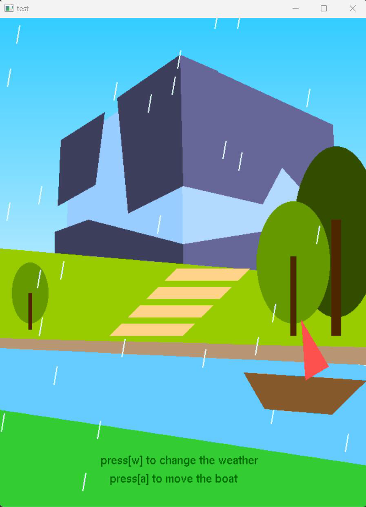
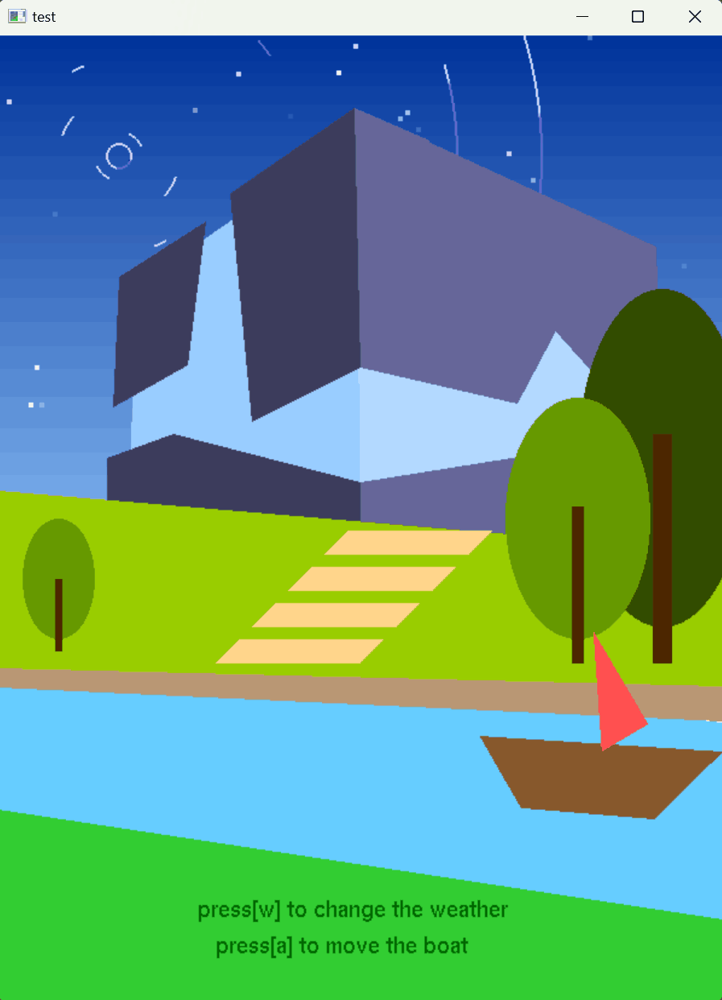
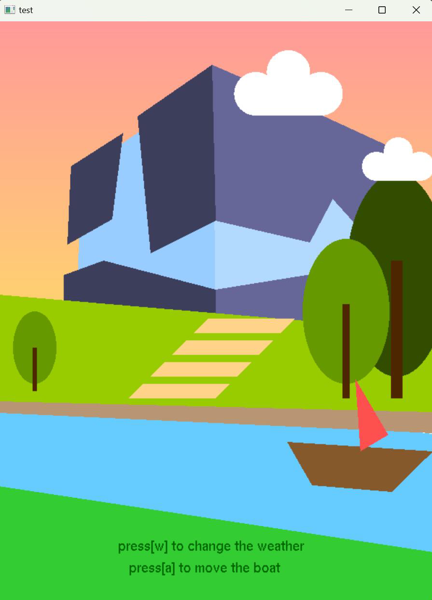
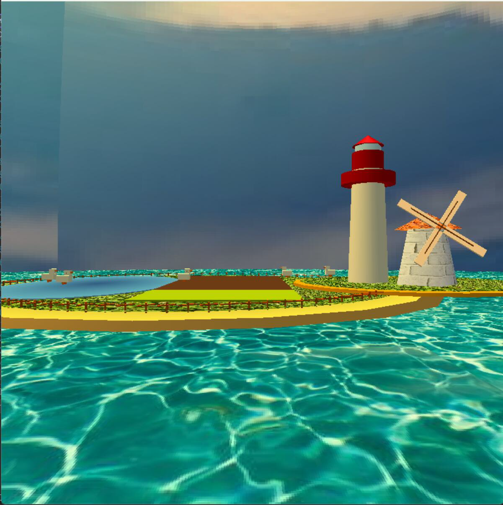
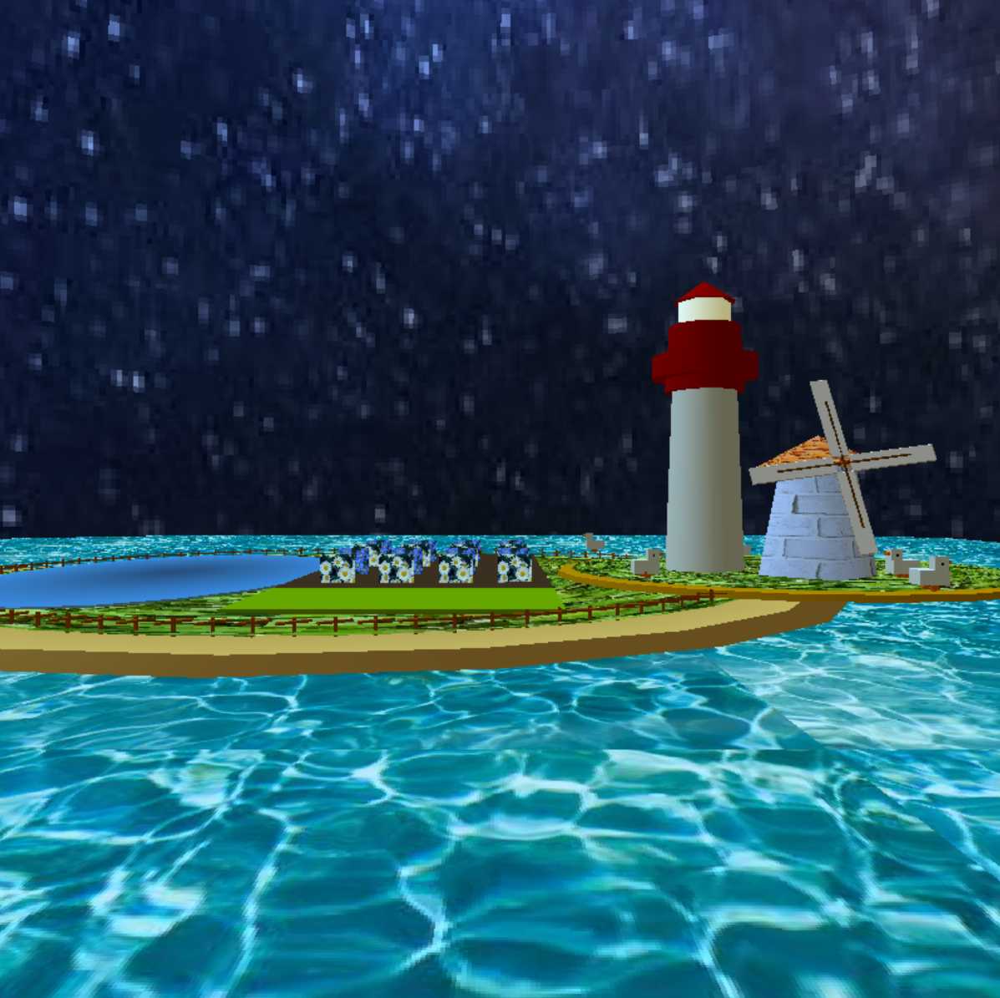
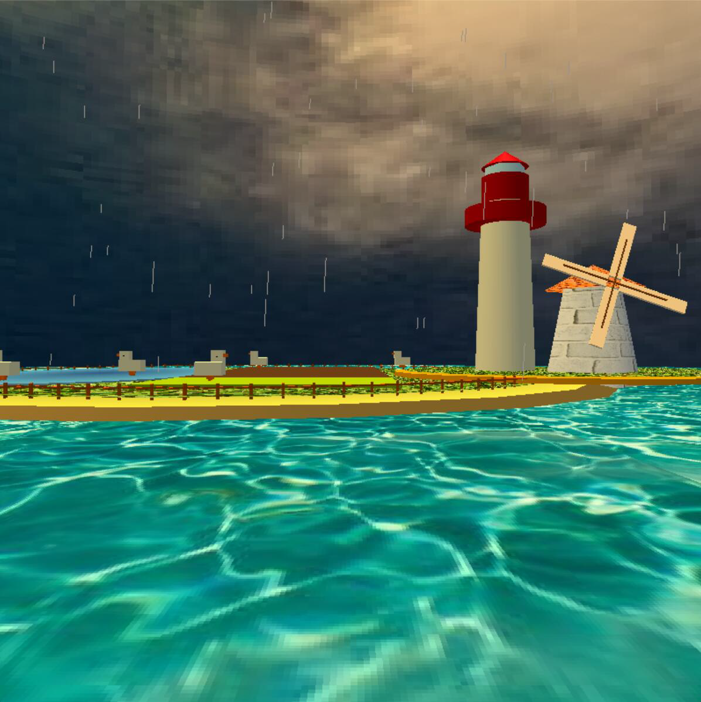

# Graphics Projects - 2D & 3D

This repository contains two projects: a 2D graduation invitation card and a 3D island simulator. Both projects are built using C++ and the FreeGLUT library, and include interactive elements controlled by the keyboard and mouse. Below are the descriptions and control instructions for each project.

## 2D Project: Graduation Invitation Card

### Description

This project involves the creation of a 2D invitation card for the 2024 XJTLU Graduation Ceremony. The card is designed using MS C++ and the 'freeglut' library. It features an initial welcome scene, with text content that becomes visible through keyboard interaction. The card’s dimensions are 800 pixels in height and 600 pixels in width, and it includes several interactive and animated effects.

  
  
  

*day, night, sunset*

### Controls

#### Mouse Interaction
- **Balloon Interaction**: 
  - Left-clicking on the balloon triggers its upward movement.
  - The balloon's color is randomly generated upon each click, giving it a playful look.
  - The balloon appears at a specific position and floats upwards as its vertical position is incremented with each frame.
  - The animation continues until the balloon reaches a certain height threshold.

#### Keyboard Interaction
- **Weather Change**: 
  - Press the `w` key to cycle through different weather conditions, changing the appearance of the sky and other elements.
  
- **Boat Animation**: 
  - Press the `a` key to activate the boat animation, which moves the boat from left to right.
  - The animation is controlled by a drive variable, and the rotation of the boat is adjusted around its center for a more natural effect.
 

## 3D Project: Retirement Simulator

### Description

This project creates a 3D scene of a small island in the sea using C++ and OpenGL FreeGLUT. The scene includes ground elements, sky elements, and 2D components. It features effects like lighting, material properties, and anti-aliasing. The main focus is on simulating a realistic environment using lighting and material properties, and implementing camera movement using 3D geometry knowledge.

This simulator represents an idealized retirement lifestyle, set in a tranquil environment with a lighthouse, windmill, fields, and ducks. It provides an escape from busy life, offering moments of peace and contentment.

  
  
  

*sunny, night, rain*

### Controls

#### Camera Movement
- The keyboard controls the camera’s movement in OpenGL. By default, the camera faces the negative z-axis, with its position near the origin.

##### Rotation:
- `W` - Look Up
- `S` - Look Down
- `A` - Look Left
- `D` - Look Right

  During rotation, the camera’s position remains fixed, but the target being observed will change. The center coordinates (C) of the camera’s view are adjusted accordingly.

##### Vertical Movement:
- `Q` - Move Up (increase `eyeY`)
- `E` - Move Down (decrease `eyeY`)

##### Horizontal Movement:
- `↑` - Move Forward
- `↓` - Move Backward
- `←` - Move Left
- `→` - Move Right

  Horizontal movement occurs along the x-z plane. The camera’s position and target coordinates are updated during each movement based on the rotation angle.

##### Weather Adjustment:
- `R` - Switch between sunny and rainy weather
- `F` - Add fog during the night

